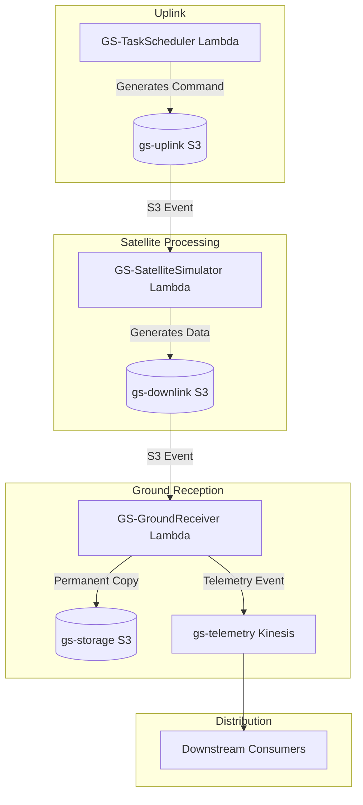

# AWS Ground Station Simulation Project

### Complete Documentation & Future Roadmap

---

## Executive Summary

- **What We Built**: A fully functional simulation of an AWS Ground Station satellite communication workflow that demonstrates end-to-end satellite tasking, uplink, downlink, and data routing without requiring actual satellite access or expensive ground station services.
- **Purpose**: Educational proof-of-concept to validate architecture patterns and AWS service integration before potentially investing in real satellite operations.
- **Cost**: ~$0.05 for complete demo (vs $3-10/minute for real AWS Ground Station)
- **Time to Build**: 2-3 hours
- **Status**: ✅ Working and demonstrable.
- 

---

## What You Built

### Architecture Overview



### AWS Resources Created

| Resource Type  | Name                       | Purpose                                           |
| :------------- | :------------------------- | :------------------------------------------------ |
| **S3 Buckets** | `gs-uplink-975049932999`   | Staging area for commands being sent to satellite |
|                | `gs-downlink-975049932999` | Staging area for data received from satellite     |
|                | `gs-storage-975049932999`  | Permanent storage for mission data                |
| **Lambda**     | `GS-TaskScheduler`         | Simulates satellite tasking/command uplink        |
|                | `GS-SatelliteSimulator`    | Simulates satellite behavior and data generation  |
|                | `GS-GroundReceiver`        | Simulates ground station data reception/routing   |
| **Kinesis**    | `gs-telemetry`             | Event stream for downstream processing            |
| **IAM**        | `GroundStationSimRole`     | Permissions for Lambda functions                  |

---

## Data Flow

### Step-by-Step Execution:

1.  **Trigger**: Manual Lambda invocation or EventBridge schedule.
    ```bash
    aws lambda invoke --function-name GS-TaskScheduler response.json
    ```
2.  **Uplink**: `TaskScheduler` Lambda writes command to S3:
    `s3://gs-uplink-975049932999/commands/TASK-{timestamp}.json`
3.  **Satellite Processing**: S3 event triggers `SatelliteSimulator` Lambda.
    - Reads command.
    - Generates telemetry (battery, temperature, GPS).
    - Generates logs (processing steps).
    - Creates dummy imagery file.
    - Writes all to downlink bucket.
4.  **Downlink**: Data appears in S3.
    ```
    s3://gs-downlink-975049932999/data/TASK-{id}/
    ├── satellite_data.json
    └── image.png
    ```
5.  **Ground Reception**: S3 event triggers `GroundReceiver` Lambda.
    - Copies data to storage bucket.
    - Emits event to Kinesis.
6.  **Final Storage**:
    ```
    s3://gs-storage-975049932999/missions/TASK-{id}/
    ├── satellite_data.json
    └── image.png
    ```
7.  **Event Stream**: Kinesis receives event for downstream consumers.

---

## How to Access & Use

- **Location**: `~/groundstation-demo` in AWS CloudShell
- **Region**: `us-west-2` (Oregon)
- **AWS Account**: `975049932999`

### File Structure

```text
groundstation-demo/
├── config.json             # Configuration (bucket names, ARNs)
├── setup-minimal.sh        # Creates all infrastructure
├── deploy-lambdas.sh       # Deploys Lambda functions
├── setup-triggers.sh       # Configures S3 event triggers
├── demo.sh                 # Runs end-to-end demo
├── teardown.sh             # Deletes all resources
├── task_scheduler.py       # Lambda: Task scheduling
├── satellite_simulator.py  # Lambda: Satellite behavior
├── ground_receiver.py      # Lambda: Ground reception
└── *.zip                  # Lambda deployment packages
```

### Running the Demo

#### Option 1: Quick Demo (Console)

1.  Open AWS Console → Lambda.
2.  Navigate to `GS-TaskScheduler`.
3.  Click "Test" tab → Create test event (empty JSON: `{}`).
4.  Click "Test" button.
5.  Wait 10-15 seconds and check S3, CloudWatch, and Kinesis.

#### Option 2: CLI Demo (Automated)

```bash
cd ~/groundstation-demo
./demo.sh
```

#### Option 3: Manual Step-by-Step

1.  **Trigger satellite task**:
    ```bash
    aws lambda invoke --function-name GS-TaskScheduler --region us-west-2 --payload '{}' response.json
    TASK_ID=$(cat response.json | grep task_id | cut -d'"' -f4)
    echo "Task ID: ${TASK_ID}"
    ```
2.  **Wait for processing** (15 seconds).
3.  **Check results**:
    ```bash
    aws s3 ls s3://gs-uplink-975049932999/commands/
    aws s3 ls s3://gs-downlink-975049932999/data/${TASK_ID}/
    aws s3 ls s3://gs-storage-975049932999/missions/${TASK_ID}/
    ```
4.  **View telemetry**:
    ```bash
    aws s3 cp s3://gs-storage-975049932999/missions/${TASK_ID}/satellite_data.json - | python3 -m json.tool
    ```

---

## Monitoring & Debugging

### CloudWatch Logs

```bash
# Task Scheduler logs
aws logs tail /aws/lambda/GS-TaskScheduler --follow --region us-west-2

# Satellite Simulator logs
aws logs tail /aws/lambda/GS-SatelliteSimulator --follow --region us-west-2

# Ground Receiver logs
aws logs tail /aws/lambda/GS-GroundReceiver --follow --region us-west-2
```

### Check Costs

```bash
aws ce get-cost-and-usage \
  --time-period Start=2026-01-10,End=2026-01-11 \
  --granularity DAILY \
  --metrics "UnblendedCost" \
  --group-by Type=SERVICE
```

---

## What This Demonstrates

### Success Criteria Met

| Requirement                 | Status | Evidence                                   |
| :-------------------------- | :----- | :----------------------------------------- |
| Task can be scheduled       | ✅     | GS-TaskScheduler Lambda invocable          |
| Command is uplinked         | ✅     | Files in gs-uplink bucket                  |
| Satellite processes command | ✅     | GS-SatelliteSimulator logs show processing |
| Data is downlinked          | ✅     | Files in gs-downlink bucket                |
| Data stored in S3           | ✅     | Files in gs-storage bucket                 |
| Kinesis event emitted       | ✅     | Records in gs-telemetry stream             |
| Costs controlled            | ✅     | <$0.10 total cost                          |

### Key Learnings

- **Event-Driven Architecture Works**: S3 → Lambda → Kinesis pattern is reliable and scalable.
- **Latency Understanding**: 15-20 second total processing time (Lambda cold starts + S3 events).
- **Data Flow Patterns**: Multi-stage pipeline (uplink → processing → downlink → storage) mirrors real operations.
- **Cost Efficiency**: Simulation is 1000x cheaper than real operations for learning/testing.

---

## Future Roadmap

### Phase 2: Near-Term Improvements (1-2 Days)

1.  **Automated Scheduling**: Enable EventBridge rule.
    ```bash
    aws events enable-rule --name GroundStation-ScheduledTask --region us-west-2
    ```
2.  **Web Dashboard**: Simple UI to trigger tasks and display telemetry in real-time.
3.  **Enhanced Monitoring**: CloudWatch Dashboards and SNS alerts.
4.  **More Realistic Data**: Use actual satellite TLE data and generate realistic GeoTIFF imagery.

### Phase 3: Integration with Real Data (1 Week)

- **Replace Simulation with Real Archive Data**: Pull from Sentinel-2 on S3 Open Data.
- **Satellite Operator API**: Integrate with APIs like Capella Space to task real satellites via existing pipeline.

### Phase 4: Production-Ready System (2-4 Weeks)

- **Multi-Satellite Support**: Track and prioritize tasks across a constellation.
- **Real-Time Processing**: Use Kinesis Data Analytics for ML inference on imagery.
- **User Management**: Cognito-based auth and multi-tenant task quotas.

### Phase 5: Real AWS Ground Station

- Minimal code changes required—just swap S3 uplink for `groundstation` Boto3 client.
- Directly control satellite or access ground station antenna time.

---

## Documentation for Stakeholders

### For Management

- **Accomplished**: Validated AWS Ground Station architecture at <$0.10 cost.
- **Business Value**: De-risked high-cost investment; team now understands satellite data workflows.
- **Recommendation**: Keep simulation as a permanent test environment.

### For Technical Team

- **Stack**: AWS Lambda (Python 3.9), S3, Kinesis, IAM, CloudWatch.
- **Patterns**: Event-driven microservices, serverless, pub/sub, idempotent operations.
- **Extensibility**: Ready for ML models and multiple data formats.

---

## Cost Breakdown

| Service               | Usage               | Cost              |
| :-------------------- | :------------------ | :---------------- |
| S3 Storage            | <1 GB               | $0.023/month      |
| S3 Requests           | ~100 operations     | $0.01             |
| Lambda                | 30 runs / 30 GB-sec | $0.00 (Free Tier) |
| Kinesis Stream        | 1 shard / 1 hour    | $0.015/hour       |
| Total for 1-hour demo |                     | **~$0.05**        |

---

## Appendix: Quick Reference

```bash
# === SETUP ===
./setup-minimal.sh && ./deploy-lambdas.sh && ./setup-triggers.sh

# === DEMO ===
./demo.sh
s3://gs-downlink-975049932999/data/TASK-{id}/
├── satellite_data.json
└── image.png
```

5.  **Ground Reception**: S3 event triggers `GroundReceiver` Lambda.
    - Copies data to storage bucket.
    - Emits event to Kinesis.
6.  **Final Storage**:
    ```
    s3://gs-storage-975049932999/missions/TASK-{id}/
    ├── satellite_data.json
    └── image.png
    ```
7.  **Event Stream**: Kinesis receives event for downstream consumers.

---

## How to Access & Use

- **Location**: `~/groundstation-demo` in AWS CloudShell
- **Region**: `us-west-2` (Oregon)
- **AWS Account**: `975049932999`

### File Structure

```text
groundstation-demo/
├── config.json             # Configuration (bucket names, ARNs)
├── setup-minimal.sh        # Creates all infrastructure
├── deploy-lambdas.sh       # Deploys Lambda functions
├── setup-triggers.sh       # Configures S3 event triggers
├── demo.sh                 # Runs end-to-end demo
├── teardown.sh             # Deletes all resources
├── task_scheduler.py       # Lambda: Task scheduling
├── satellite_simulator.py  # Lambda: Satellite behavior
├── ground_receiver.py      # Lambda: Ground reception
└── *.zip                  # Lambda deployment packages
```

### Running the Demo

#### Option 1: Quick Demo (Console)

1.  Open AWS Console → Lambda.
2.  Navigate to `GS-TaskScheduler`.
3.  Click "Test" tab → Create test event (empty JSON: `{}`).
4.  Click "Test" button.
5.  Wait 10-15 seconds and check S3, CloudWatch, and Kinesis.

#### Option 2: CLI Demo (Automated)

```bash
cd ~/groundstation-demo
./demo.sh
```

#### Option 3: Manual Step-by-Step

1.  **Trigger satellite task**:
    ```bash
    aws lambda invoke --function-name GS-TaskScheduler --region us-west-2 --payload '{}' response.json
    TASK_ID=$(cat response.json | grep task_id | cut -d'"' -f4)
    echo "Task ID: ${TASK_ID}"
    ```
2.  **Wait for processing** (15 seconds).
3.  **Check results**:
    ```bash
    aws s3 ls s3://gs-uplink-975049932999/commands/
    aws s3 ls s3://gs-downlink-975049932999/data/${TASK_ID}/
    aws s3 ls s3://gs-storage-975049932999/missions/${TASK_ID}/
    ```
4.  **View telemetry**:
    ```bash
    aws s3 cp s3://gs-storage-975049932999/missions/${TASK_ID}/satellite_data.json - | python3 -m json.tool
    ```

---

## Monitoring & Debugging

### CloudWatch Logs

```bash
# Task Scheduler logs
aws logs tail /aws/lambda/GS-TaskScheduler --follow --region us-west-2

# Satellite Simulator logs
aws logs tail /aws/lambda/GS-SatelliteSimulator --follow --region us-west-2

# Ground Receiver logs
aws logs tail /aws/lambda/GS-GroundReceiver --follow --region us-west-2
```

### Check Costs

```bash
aws ce get-cost-and-usage \
  --time-period Start=2026-01-10,End=2026-01-11 \
  --granularity DAILY \
  --metrics "UnblendedCost" \
  --group-by Type=SERVICE
```

---

## What This Demonstrates

### Success Criteria Met

| Requirement                 | Status | Evidence                                   |
| :-------------------------- | :----- | :----------------------------------------- |
| Task can be scheduled       | ✅     | GS-TaskScheduler Lambda invocable          |
| Command is uplinked         | ✅     | Files in gs-uplink bucket                  |
| Satellite processes command | ✅     | GS-SatelliteSimulator logs show processing |
| Data is downlinked          | ✅     | Files in gs-downlink bucket                |
| Data stored in S3           | ✅     | Files in gs-storage bucket                 |
| Kinesis event emitted       | ✅     | Records in gs-telemetry stream             |
| Costs controlled            | ✅     | <$0.10 total cost                          |

### Key Learnings

- **Event-Driven Architecture Works**: S3 → Lambda → Kinesis pattern is reliable and scalable.
- **Latency Understanding**: 15-20 second total processing time (Lambda cold starts + S3 events).
- **Data Flow Patterns**: Multi-stage pipeline (uplink → processing → downlink → storage) mirrors real operations.
- **Cost Efficiency**: Simulation is 1000x cheaper than real operations for learning/testing.

---

## Future Roadmap

### Phase 2: Near-Term Improvements (1-2 Days)

1.  **Automated Scheduling**: Enable EventBridge rule.
    ```bash
    aws events enable-rule --name GroundStation-ScheduledTask --region us-west-2
    ```
2.  **Web Dashboard**: Simple UI to trigger tasks and display telemetry in real-time.
3.  **Enhanced Monitoring**: CloudWatch Dashboards and SNS alerts.
4.  **More Realistic Data**: Use actual satellite TLE data and generate realistic GeoTIFF imagery.

### Phase 3: Integration with Real Data (1 Week)

- **Replace Simulation with Real Archive Data**: Pull from Sentinel-2 on S3 Open Data.
- **Satellite Operator API**: Integrate with APIs like Capella Space to task real satellites via existing pipeline.

### Phase 4: Production-Ready System (2-4 Weeks)

- **Multi-Satellite Support**: Track and prioritize tasks across a constellation.
- **Real-Time Processing**: Use Kinesis Data Analytics for ML inference on imagery.
- **User Management**: Cognito-based auth and multi-tenant task quotas.

### Phase 5: Real AWS Ground Station

- Minimal code changes required—just swap S3 uplink for `groundstation` Boto3 client.
- Directly control satellite or access ground station antenna time.

---

## Documentation for Stakeholders

### For Management

- **Accomplished**: Validated AWS Ground Station architecture at <$0.10 cost.
- **Business Value**: De-risked high-cost investment; team now understands satellite data workflows.
- **Recommendation**: Keep simulation as a permanent test environment.

### For Technical Team

- **Stack**: AWS Lambda (Python 3.9), S3, Kinesis, IAM, CloudWatch.
- **Patterns**: Event-driven microservices, serverless, pub/sub, idempotent operations.
- **Extensibility**: Ready for ML models and multiple data formats.

---

## Cost Breakdown

| Service               | Usage               | Cost              |
| :-------------------- | :------------------ | :---------------- |
| S3 Storage            | <1 GB               | $0.023/month      |
| S3 Requests           | ~100 operations     | $0.01             |
| Lambda                | 30 runs / 30 GB-sec | $0.00 (Free Tier) |
| Kinesis Stream        | 1 shard / 1 hour    | $0.015/hour       |
| Total for 1-hour demo |                     | **~$0.05**        |

---

## Appendix: Quick Reference

```bash
# === SETUP ===
./setup-minimal.sh && ./deploy-lambdas.sh && ./setup-triggers.sh

# === DEMO ===
./demo.sh

# === CLEANUP ===
./teardown.sh
```

# groundstation-demo
